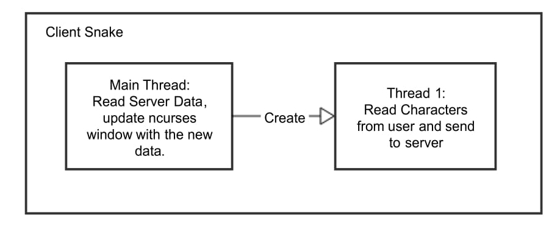

# Snakes

A multiplayer snakes game build using C and the ncurses library. The network protocol that will be used is TCP/IP. The program will be divided into two sections: the server and the client. The camera centres on the player's snake head and the settings of the game (like size of the map, win score ..) and customisable.


## Design

To cater to the infinite number of connections to the server, pthreads were used.

### Threads

In the client side of the system, there are in total 2 threads, including the main thread, as seen in below. Note that these threads do not share data and thus no locks were required.

* The Main Thread: When the program gets executed, the thread initialise the settings for the ncurses library and creates Thread 1. The thread then waits for data, received from the server, and updates the window of ncurses appropriately. If the server indicates that the snake died or there was a connection lost, the thread cleans all data/thread used and exits the system. Whenever the server indicates an action that requires the game to restart, the game cleans all data/thread used and re-initiase the data/thread required for the game.

* Thread 1: The job of this thread is to read the characters (w, a, s and d) pressed by the user to change the direction of it's snake. Whenever the user presses a key, the value of that key is sent to the server. No data to the server is sent if the key pressed makes the snake go to the other direction resulting in the snake killing himself or the snake is currently at that direction. Every time the game restarts, the thread is killed, used data freed and thread created again.



In the server side of the system, there are in total 5 threads, including the main thread, as seen in below. Some of these threads use shared memory and thus locks are used.

* The Main Thread: When the program gets executed, the main thread creates the server thread (Thread 1) and the game thread (Thread 2). The main then waits for the game thread to finish, indicating that a game has ended (a Snake won) and thus the game needs to be restarted. Whenever a game restarts all data/threads used will be cleared and re-initialised except for the server thread and the socket file descriptors.

* Thread 1: This thread creates the TCP/IP server that accepts any address. If the server was created successfully, the server will listen for any clients otherwise exits the program. Whenever a client is accepted by the server, another thread is created to handle the new connection and the server thread continues to listen for other connections. This thread can create many child threads and therefore the server is capable of handling multiple requests from different clients simultaneously.

* Thread 3-many: These threads are created by the server to handle a new connection so that the server can be left listening to other connections. Whenever this thread is created, it determine the initial positions of the snakes where there are no other snakes/foods on. The snake, the socket file descriptor and a unique ID to the client used are saved inside a struct and the struct is saved inside a vector. Afterwards, all the snakes and foods positions are re-sent by the thread to all clients to inform another player joined the game and give the new player the current map. Note that this thread only sends data one time, it is deleted shortly after. When the snake is determining the new position and adding the item to the vector, the vector is locked using a mutex lock to prevent other threads from accessing the vector.

* Thread 2: The job of this thread is to be the game manager. It creates Thread 4 and Thread 5 which are needed for the game. If the thread creation was successful, this thread will handle the movements of all snakes periodically. When there is a movement action, all snakes will move. There are 4 conditions the thread check for every snake. 
	* If the next position results in two snakes colliding head-to-head, both snakes will die. All clients are informed with the dead.
	* If the next position results in the snake colliding with another snake or with the game border, the snake will die. All clients are informed with the dead.
	* If the next position results in a location of a food, the snake will grow and move afterwards. If the snake reaches the winning size, all clients are informed with the win and restarts the game. Note that there could be multiple winners. The thread will also send the foods positions to all clients to inform that the food was eaten.
	* If nothing from above occured, move all positions of the snake to the new positions. Clients are informed with all the new snakes positions.
Before using and updating the snakes, a lock is used. Other threads can add or remove items from the vectors used and thus could cause trouble when updating the snake. Since lock is used, the thread was kept single threaded (instead of having a thread for every snake) since other threads would need to wait for the lock to be unlocked.

* Thread 4: The thread manages the creation of foods. For every random interval a food is generated at a random location which is empty. When a food is generated, all food positions are sent to all clients. A lock is used every time a food needs to be created since it needs to check positions to ensure it is not taken.

* Thread 5: This thread reads the new direction of the snake sent from the client. To handle multiple clients, the socket was temporary switched to non-blocking instead blocking thus the read function will not wait for data to be received, an error will be shown instead. This error can be read and ignore if it matches that no data was found in the socket. Whenever the threads need to change the direction of a snake, a lock is used to ensure that the change will not effect the movement action. 


### Network

The following shows the delimiters used to communicate between the client and the server. 


The communication with delimiters can be seen below:


## Build

The system can be built with either Make or CMake. Pthread and ncurses library are needed.

To run the server use:

```
./server <port>
```

To run the client use:

```
./client <server-ip> <server-port>
```

## License

This project is licensed under MIT.
